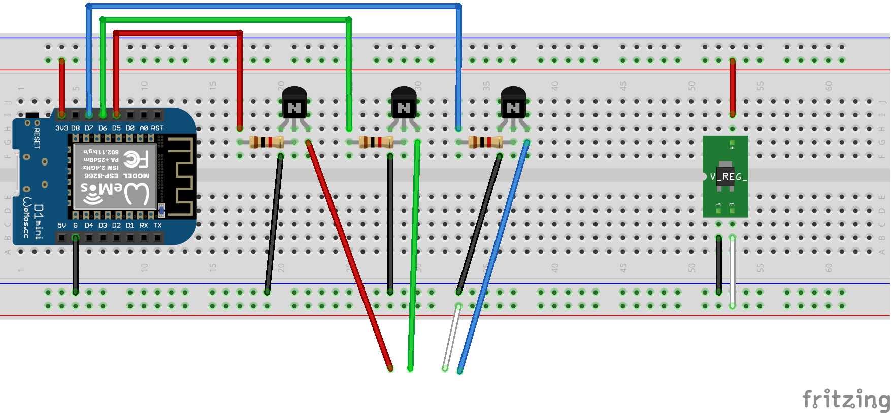
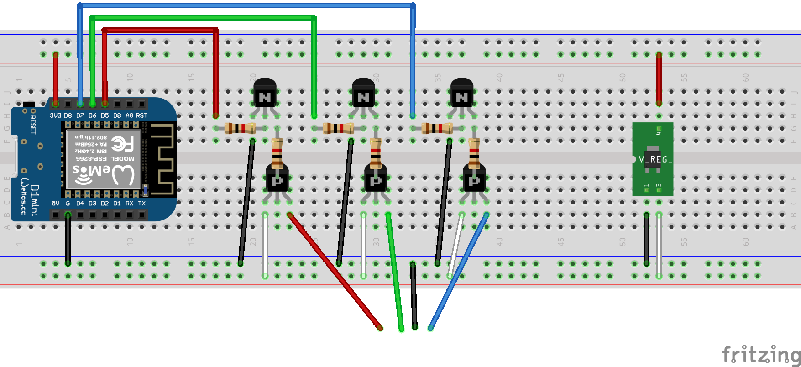

# Underglow

Funderglow  
  
Open source, DIY, customizable underglow system.

## Parts List

The parts needed will depend on the leds you want to use. I strongly suggest
you purchase premade 12v led strips. It will save many hours of soldering and may
be cheaper than buying the individual rgb leds, resistors, and wire.  

Led strips are eiter in a common cathode or common anode configuration. If
there is a single 12v pin and three color pins then that strip is common anode.
If there is a single ground pin and three color pins then that strip is common
cathode. You can easily test this with a multimeter if you are unsure.  

These are commone anode strips and very cheap: https://www.amazon.com/gp/product/B07XXQD5PG  

### Common Anode Led Controller Parts
* 1 x Wemos D1 Mini (or other esp8266 dev board)
* 1 x DROK variable voltage regulator
* 3 x NPN 2222 Transistor
* 3 x 1k Ohm resistor

### Common Cathode Led Controller Parts
* 1 x Wemos D1 Mini (or other esp8266 dev board)
* 1 x DROK variable voltage regulator
* 3 x NPN 2222 Transistor
* 3 x PNP 2907 Transistor
* 6 x 1k Ohm resistor

### DIY Led Strips (Just buy them!)
* N x Common-Cathode 20mA RGB Led
* N x 680 Ohm Resistor
* N x hours of labor
