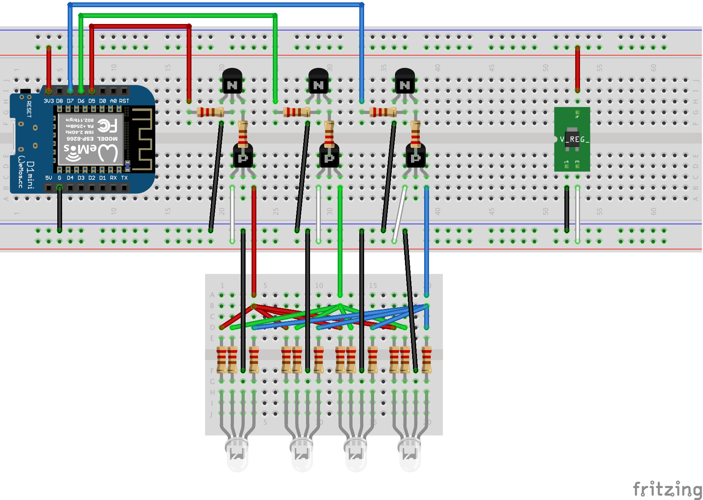

# Underglow

Open source, DIY, customizable underglow system.

## Parts List
3 x NPN 2222 Transistor
3 x PNP 3906 Transistor
6 x 1k Ohm resistor
N x Common-Cathode 20mA RGB Led
N x 500 Ohm Resistor
N is number of desired LEDs in array
1 x DROK variable voltage regulator

## Breadboard Circuit

